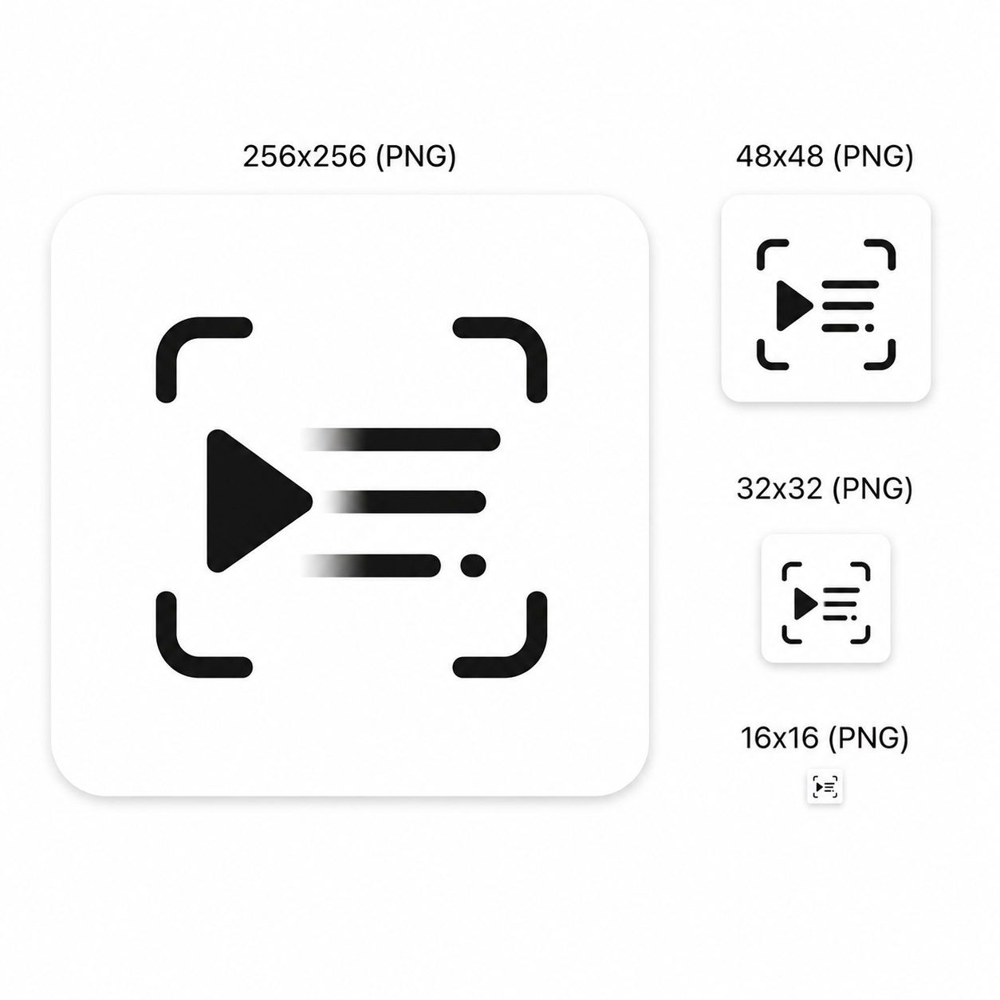

<p align="center">
  
</p>

<h1 align="center">KeyOCR</h1>

<p align="center">
  <strong>影片智慧分幀 + OCR 文字提取工具</strong><br>
  從影片中自動提取關鍵幀，批次辨識文字，糾錯輸出最終結果
</p>

<p align="center">
  <a href="README.md">English</a> · <a href="README_zh-CN.md">简体中文</a>
</p>

---

## 功能特性

| 功能 | 說明 |
|------|------|
| **智慧分幀** | 基於場景轉換點偵測，自動提取關鍵幀，14x 壓縮率（4020 幀 → 96 幀） |
| **自動 OCR 區域偵測** | Sobel 邊緣偵測 + 投票機制，自動定位字幕區域 |
| **手動 OCR 區域選擇** | 支援滑鼠框選自訂 OCR 辨識區域 |
| **批次 OCR** | Windows GPU（PaddleOCR 3.x）/ macOS CPU（RapidOCR），自動切換 |
| **OCR 文字合併去重** | 前綴重疊、擴展關係、後綴拼接，減少 45% 冗餘 |
| **AI 文字糾錯** | 呼叫大模型 API 自動修正 OCR 錯誤，支援自訂提示詞 |
| **批次處理** | 多個影片排隊處理，失敗自動跳過 |
| **一鍵提取** | 分幀 → 區域偵測 → OCR → AI 糾錯，全流程自動化 |
| **中文路徑相容** | Windows 中文目錄/檔名全程相容（符號連結 + imencode 回退） |

## 下載安裝

前往 [Releases](../../releases/latest) 頁面下載：

| 平台 | 檔案 | 說明 |
|------|------|------|
| Windows | `KeyOCR_Setup.exe` | 安裝程式（推薦），預設安裝到 `D:\KeyOCR` |
| Windows | `KeyOCR.exe` | 便攜版，解壓即用 |
| macOS | `KeyOCR-macOS.zip` | 解壓後雙擊執行 |

### Windows

1. 下載 `KeyOCR_Setup.exe`
2. 執行安裝程式，可自訂安裝目錄（建議英文路徑）
3. 雙擊桌面捷徑啟動

> **GPU 加速**：需 NVIDIA 顯示卡 + CUDA 11.8 + cuDNN。無顯示卡時自動使用 CPU OCR，無需額外設定。

### macOS

1. 下載 `KeyOCR-macOS.zip`
2. 解壓後將 `KeyOCR.app` 拖入 Applications
3. 首次執行如提示「無法驗證開發者」，右鍵 → 打開

> macOS 僅支援 CPU OCR（RapidOCR），無需安裝額外依賴。

## 使用方法

### 基本流程

1. **選擇影片** — 點擊「選擇影片」按鈕，支援多選（多選自動開啟批次處理）
2. **一鍵提取** — 點擊「一鍵提取」，自動完成：
   - 智慧分幀：偵測場景轉換點，提取關鍵幀
   - 區域偵測：自動定位字幕區域（也可手動框選）
   - 批次 OCR：逐幀辨識文字
   - 文字合併：去重合併相鄰幀重複內容
   - AI 糾錯：呼叫大模型修正 OCR 錯誤
3. **檢視結果** — 點擊「開啟資料夾」檢視輸出

### 設定說明

點擊右上角「設定」按鈕可設定：

- **API 設定** — 填寫 API URL、Key、模型名稱（AI 糾錯必須）
- **OCR 引擎** — 自動 / 強制 CPU / 強制 GPU
- **OCR 區域** — 自動偵測 / 手動框選
- **AI 提示詞** — 自訂糾錯範本，使用 `{ocr_text}` 作為 OCR 文字佔位符
- **自動清理** — 開啟後 AI 糾錯完成自動刪除中間檔案，只保留最終結果
- **清除快取** — 刪除所有中間幀圖片，保留最終版檔案

### 輸出目錄

- 中間幀：`{安裝目錄}/cache/{影片名}_frames/`
- 最終結果：`{安裝目錄}/最終版/{影片名}-最終版.txt`

## 從原始碼執行

```bash
git clone https://github.com/Ha1baraA11/KeyOCR.git
cd KeyOCR
```

### macOS（CPU）

```bash
pip install PySide6 opencv-contrib-python==4.10.0.84 numpy rapidocr-onnxruntime
python frame_extractor_gui.py
```

### Windows（GPU）— 完整安裝指南

#### 前置條件

| 元件 | 版本 | 說明 |
|------|------|------|
| Python | 3.10 或 3.12 | paddlepaddle-gpu 不支援 3.13+ |
| NVIDIA 顯示卡 | 任意支援 CUDA 的顯示卡 | 推薦 RTX 20/30/40 系列 |
| CUDA Toolkit | 11.8 | 必須與 paddlepaddle-gpu 版本匹配 |
| cuDNN | 8.6+（對應 CUDA 11.8） | PaddlePaddle 執行必需 |

#### 第一步：安裝 CUDA Toolkit 11.8

1. 開啟 [NVIDIA CUDA Toolkit 歸檔頁](https://developer.nvidia.com/cuda-toolkit-archive)
2. 選擇 **CUDA Toolkit 11.8.0**
3. 選擇系統設定：**Windows → x86_64 → 10/11 → exe (local)**
4. 下載約 3 GB 的安裝程式
5. 執行安裝程式，選擇 **自訂（進階）**
6. 確保勾選 **CUDA > Development** 和 **CUDA > Runtime**
7. 完成安裝

驗證安裝：

```bash
nvcc --version
# 應輸出：Cuda compilation tools, release 11.8
```

> 如果提示 `nvcc` 找不到，需要將 `C:\Program Files\NVIDIA GPU Computing Toolkit\CUDA\v11.8\bin` 加入系統 PATH 環境變數。

#### 第二步：安裝 cuDNN

1. 開啟 [NVIDIA cuDNN 下載頁](https://developer.nvidia.com/rdp/cudnn-archive)（需要註冊免費 NVIDIA 帳號）
2. 選擇 **cuDNN v8.6.0（或更高版本）for CUDA 11.x**
3. 下載 **Windows** 版本的 zip 檔案
4. 解壓後將檔案複製到 CUDA 安裝目錄：
   - `bin\cudnn*.dll` → `C:\Program Files\NVIDIA GPU Computing Toolkit\CUDA\v11.8\bin`
   - `include\cudnn*.h` → `C:\Program Files\NVIDIA GPU Computing Toolkit\CUDA\v11.8\include`
   - `lib\x64\cudnn*.lib` → `C:\Program Files\NVIDIA GPU Computing Toolkit\CUDA\v11.8\lib\x64`

#### 第三步：安裝 Python 依賴

開啟 PowerShell 或 CMD，按順序執行：

```bash
# 1. 安裝 Python（3.10 或 3.12，不要用 3.13+）
#    下載地址：https://www.python.org/downloads/
#    安裝時勾選 "Add Python to PATH"

# 2. 移除衝突的 OpenCV 套件
python -m pip uninstall opencv-python opencv-contrib-python opencv-python-headless -y

# 3. 安裝 OpenCV（必須用 contrib 版本，鎖定 4.10.0.84）
python -m pip install opencv-contrib-python==4.10.0.84

# 4. 安裝 PaddlePaddle GPU 版（必須用百度官方鏡像，不能用 PyPI）
python -m pip install paddlepaddle-gpu==3.3.0 -i https://www.paddlepaddle.org.cn/packages/stable/cu118/

# 5. 安裝 PaddleOCR 和 PaddleX
python -m pip install paddleocr "paddlex[ocr]" pypdfium2

# 6. 安裝 PaddleOCR 執行時依賴
python -m pip install pandas scipy scikit-image shapely pyclipper rapidfuzz lmdb pyyaml tqdm protobuf Pillow requests

# 7. 安裝 GUI 框架
python -m pip install PySide6 numpy
```

> **重要提示**：`paddlepaddle-gpu` 不在 PyPI 上，必須使用 PaddlePaddle 官方鏡像（`-i https://www.paddlepaddle.org.cn/...`）。如果用 `pip install paddlepaddle` 從 PyPI 安裝，裝的是 CPU 版本，不支援 GPU 加速。

#### 第四步：執行程式

```bash
python frame_extractor_gui.py
```

#### 第五步：驗證 GPU 是否正常運作

在程式中開啟 設定 → OCR 引擎，應顯示"GPU (PaddleOCR)"可用。

或手動驗證：

```bash
python -c "import paddle; print('CUDA:', paddle.device.is_compiled_with_cuda())"
# 應輸出：CUDA: True
```

### Windows（CPU，無顯示卡）

如果沒有 NVIDIA 顯示卡，使用簡化的 CPU 方案：

```bash
python -m pip install opencv-contrib-python==4.10.0.84 PySide6 numpy rapidocr-onnxruntime
python frame_extractor_gui.py
```

### 環境驗證

```bash
python -c "import cv2; print('cv2:', cv2.__version__)"
python -c "import paddle; print('paddle:', paddle.__version__, 'CUDA:', paddle.device.is_compiled_with_cuda())"
python -c "import paddleocr; import paddlex; print('paddleocr+paddlex OK')"
python -c "from rapidocr_onnxruntime import RapidOCR; print('rapidocr OK')"
```

## Windows 打包

### 自動打包（CI）

Push 到 main 分支自動觸發 GitHub Actions：建置 → 自檢 → 建立 Release。

### 本機打包

```bash
# 雙擊 build.bat 或手動執行：
python -m pip install pyinstaller
pyinstaller frame_extractor.spec
```

打包後自動執行自檢（`KEYOCR_SELF_CHECK=1`），驗證 EXE 內模組完整性 + CUDA 可用性。

### 產生安裝程式

打包完成後，使用 Inno Setup 開啟 `frame_extractor.iss` 編譯產生安裝程式。

## OCR 引擎

| 引擎 | 平台 | 依賴 | 說明 |
|------|------|------|------|
| PaddleOCR 3.x | Windows (CUDA) | `paddlepaddle-gpu` + `paddlex[ocr]` | GPU 加速，速度快 |
| RapidOCR | macOS / Windows CPU 回退 | `rapidocr-onnxruntime` | 純 CPU，無需 GPU |

程式啟動時自動偵測 CUDA 可用性：
- Windows + CUDA 可用 → PaddleOCR（GPU）
- Windows + CUDA 不可用 → RapidOCR（CPU），日誌提示原因
- macOS → 始終使用 RapidOCR（CPU）

## 演算法說明

### 智慧分幀

基於影片場景轉換點偵測：

1. 以 9fps 粗掃截幀
2. 計算相鄰幀差異，偵測峰值（差異 > 中位數 × 1.5）
3. 每個峰值只取 1 幀，避免冗餘

### OCR 區域偵測

Sobel 水平邊緣 + 投票機制：

1. 從提取的幀中取樣 16 幀
2. 每幀獨立偵測字幕區域（Sobel 邊緣 → 行聚集 → 取最強兩個聚集）
3. 投票取中位數，確保穩定性

### OCR 文字合併

四種合併策略：
- **前綴重疊**：當前幀是前一幀的前綴 → 跳過
- **擴展關係**：前一幀是當前幀的前綴 → 替換為更長版本
- **公共前綴**：重疊超過 50% → 保留最長版本
- **後綴重疊**：前一幀後綴 = 當前幀前綴 → 拼接成完整句子

## 專案結構

```
KeyOCR/
├── frame_extractor_gui.py    # 主程式（GUI + 演算法 + OCR + AI 糾錯）
├── frame_extractor.spec      # PyInstaller 打包設定
├── frame_extractor.iss       # Inno Setup 安裝程式腳本
├── runtime_hook_cv2.py       # PyInstaller runtime hook
├── build.bat                 # Windows 本機打包腳本
├── detect_region.py          # 區域偵測獨立測試腳本
├── merge_ocr.py              # OCR 結果本機合併去重腳本
├── run_test.py               # 測試腳本
├── test_region_detect.py     # 區域偵測單元測試
├── icon.ico                  # 應用程式圖示
├── KeyOCR_logo.png           # 專案 Logo
└── requirements.txt          # Python 依賴清單
```

## 常見問題

### GPU OCR 不工作

1. 確認有 NVIDIA 顯示卡：`nvidia-smi`
2. 確認 CUDA 11.8 已安裝：`nvcc --version`
3. 確認 paddle 是 GPU 版：`python -c "import paddle; print(paddle.device.is_compiled_with_cuda())"`
4. 如果輸出 False，重新安裝：`python -m pip install paddlepaddle-gpu==3.3.0 -i https://www.paddlepaddle.org.cn/packages/stable/cu118/`

### PaddleX 模型快取損壞

清除快取目錄後重新執行：
- Windows：`rmdir /s /q C:\Users\{使用者名稱}\.paddlex`
- macOS/Linux：`rm -rf ~/.paddlex`

### 中文路徑報錯

程式已內建中文路徑相容，如仍遇問題：
- 將影片移到英文路徑下
- 或使用安裝版（預設安裝到 `D:\KeyOCR`）

### AI 糾錯不生效

1. 確認已在設定中填寫 API Key
2. 確認 API URL 可存取
3. 檢查模型名稱是否正確

## 技術堆疊

- **GUI**：PySide6（Qt for Python）
- **影片處理**：OpenCV
- **OCR**：PaddleOCR 3.x（GPU）/ RapidOCR（CPU）
- **AI 糾錯**：OpenAI 相容 API（支援任意相容介面）
- **打包**：PyInstaller + Inno Setup

## License

MIT
